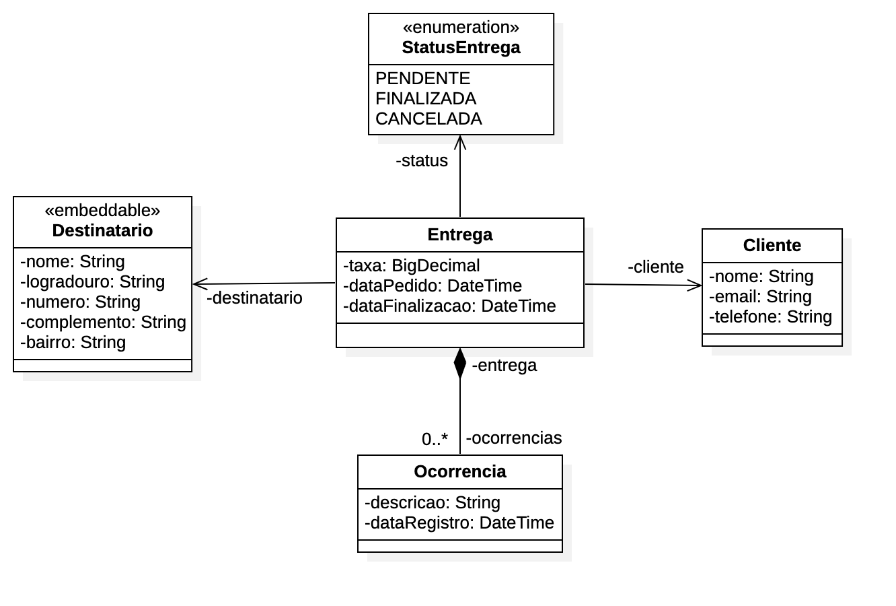

Mergulho Spring Rest 17 
---

Uma API Rest desenvolvida com Spring e banco de dados MySQL

Tecnologias Utilizadas
---
+	Spring Framework
+	Flayway

Entidades do Sistema
---
+	Entrega
+	Cliente
+	Destinatario
+	Ocorrencias

Diagrama de classes
---


API Rest Algalog
---

Versao: v0.1.0

## Métodos GET ##

1. Listar Clientes
2. Listar Entregas
3. Listar Cliente por ID
4. Listar Entrega por ID
5. Listar Ocorrencias

## Métodos POST ##

1. Cadastrar Cliente
2. Cadastar Entrega
3. Cadastrar Ocorrencia
4. Atualizar Cliente


## Método PUT ##
1. Atualizar Cliente
2. Finalizar Entrega

## Método DELETE ##
1. Deletar Cliente


## Listar Clientes ## 

Método: **GET**
http://localhost:8080/clientes

### Responses ### 

**Status: 200 - Um array de Clientes**

Exemplo de resposta do Servidor

```json
[
	{
		"id": 1,
		"nome": "Fernando",
		"email": "fernando@algaworks.com",
		"telefone": "34 97778-9990"
	},
	{
		"id": 2,
		"nome": "Maria Stuart",
		"email": "mariastuart@algaworks.com",
		"telefone": "34 92222-9111"
	},
	{
		"id": 3,
		"nome": "Maria da Gloria",
		"email": "mariadagloria@algaworks.com",
		"telefone": "34 91111-91123"
	}
]
```

## Listar Cliente por ID ##

Método: **GET**

http://localhost:8080/clientes/{clienteId}


### Parâmetros ###
Parâmetro| tipo
---------|-------
clienteId| numeral

### Responses ### 
**Status: 200 - Um objeto cliente**


Exemplo de Resposta do servidor

```json
{
	"id": 1,
	"nome": "Fernando",
	"email": "fernando@algaworks.com",
	"telefone": "34 97778-9990"
}
```

## Listar Entregas ##

Método: **GET**
http://localhost:8080/entregas

### Responses ###

**Status: 200 - Um array de objetos Entrega**

Exemplo de resposta do Servidor:

```json
[
	{
		"id": 1,
		"cliente": {
			"id": 1,
			"nome": "Fernando"
		},
		"taxa": 100.50,
		"status": "FINALIZADA",
		"destinatario": {
			"nome": "Joaquim da Silva",
			"logradouro": "Rua das Goiabas",
			"numero": "100",
			"complemento": "Apto 200",
			"bairro": "centro"
		},
		"dataPedido": "2023-03-19T04:41:01-03:00",
		"dataFinalizacao": "2023-03-19T19:55:51-03:00"
	}
]
```

## Listar Entrega por ID ##

Método: **GET**

### Responses ###

**Status: 200 - Um objeto Entrega**

Exemplo de resposta do servidor

```json
{
	"id": 1,
	"cliente": {
		"id": 1,
		"nome": "Fernando"
	},
	"taxa": 100.50,
	"status": "FINALIZADA",
	"destinatario": {
		"nome": "Joaquim da Silva",
		"logradouro": "Rua das Goiabas",
		"numero": "100",
		"complemento": "Apto 200",
		"bairro": "centro"
	},
	"dataPedido": "2023-03-19T04:41:01-03:00",
	"dataFinalizacao": "2023-03-19T19:55:51-03:00"
}
```
